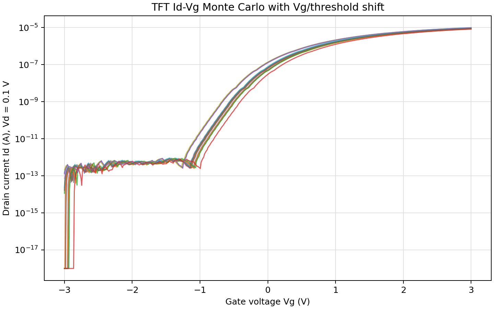
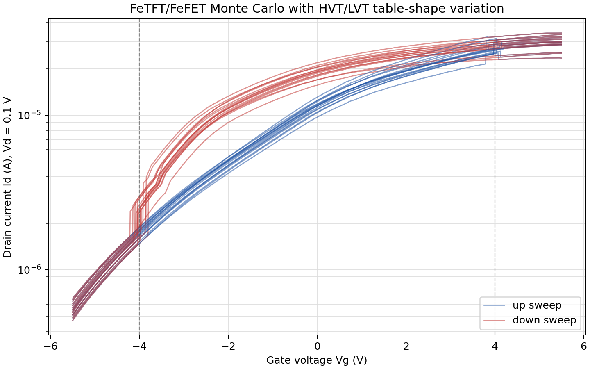

# ngspice Monte Carlo TFT and FeTFT Models

This note documents the minimal stock-ngspice Monte Carlo decks for the TFT and
FeTFT/FeFET table models.

## Files

- `tft_monte_carlo_idvg.sp`
  - TFT Id-Vg Monte Carlo deck.
  - Includes the existing `../NG_spice_TFT/tft_n1_ngspice.inc`.
- `../NG_spice_FeTFT/fetft_nf1_vds0p1_ngspice.inc`
  - Native ngspice FeTFT/FeFET model include generated from the original HSPICE
    Verilog-A HVT/LVT conductance-table behavior.
  - Uses the `Vd = 0.1 V` Id-Vg table slice.
- `fetft_monte_carlo_idvg.sp`
  - FeTFT/FeFET Id-Vg hysteresis Monte Carlo deck.
  - Includes `../NG_spice_FeTFT/fetft_nf1_vds0p1_ngspice.inc`.

Generated `.dat`, `.log`, and `.raw` files are not committed. The `plots/`
directory keeps example Ubuntu `ngspice-36` plots for quick visual reference.

## Run

From this `NG_spice_MonteCarlo` directory:

```sh
ngspice -b -o tft_monte_carlo_idvg.log tft_monte_carlo_idvg.sp

ngspice -b -o fetft_monte_carlo_idvg.log fetft_monte_carlo_idvg.sp
```

Each run writes a `.dat` table with one time column, one global `v(g)` column,
and 16 sampled drain-current columns: `id00` through `id15`.

## Monte Carlo Method

The decks use a FlexIC-style parallel-sample pattern. Each deck instantiates 16
copies of the device in one transient simulation:

```spice
Xmc00 ...
Xmc01 ...
...
Xmc15 ...
```

Each instance receives independent `agauss(mean, abs_variation, sigma)` draws at
netlist evaluation time. In these decks the third argument is `3`, so the
second argument is treated as the approximate 3-sigma absolute spread.

## TFT Variation

The TFT deck varies:

- `W`: device width around `Wnom = 8e-6`.
- `L`: device length around `Lnom = 3e-6`.
- `M`: current/multiplicity scale around `Mnom = 1`.
- `Vg/threshold shift`: each sample has a separate shifted gate node.

The threshold-shift provision is implemented with a DC voltage source between
the global gate and the sampled-device gate:

```spice
Vsh00 g g00 dc={agauss(0,Vshift3s,3)}
Xmc00 d00 0 g00 tft_n1_ngspice ...
```

`Vshift3s = 0.30` means the gate/threshold shift has about 0.30 V 3-sigma
spread. Positive or negative samples shift the apparent turn-on voltage.

The underlying TFT include still uses the measured conductance table and scales
current as a first-order geometry/current multiplier. It does not create a new
physics-based threshold model.

Example TFT Monte Carlo result with Vg/threshold-shift variation:



## FeTFT/FeFET Variation

The FeTFT/FeFET deck varies:

- `vw`: polarization switching voltage around 4 V.
- `scale`: overall current multiplier.
- `hvt_vshift`: HVT table gate-voltage shift.
- `lvt_vshift`: LVT table gate-voltage shift.
- `hvt_scale`: HVT branch conductance multiplier.
- `lvt_scale`: LVT branch conductance multiplier.
- `hvt_tilt`: HVT conductance-table slope/shape tilt versus Vg.
- `lvt_tilt`: LVT conductance-table slope/shape tilt versus Vg.

The FeTFT include computes the selected HVT/LVT conductance like this:

```spice
Bghvt ghvt 0 V={hvt_scale*(1+hvt_tilt*V(vgeff)/5.5)*fetft_g_hvt_vds0p1(V(vgeff)-hvt_vshift)}
Bglvt glvt 0 V={lvt_scale*(1+lvt_tilt*V(vgeff)/5.5)*fetft_g_lvt_vds0p1(V(vgeff)-lvt_vshift)}
```

The polarization state selects HVT or LVT:

- `Vg > +vw`: switch to LVT.
- `Vg < -vw`: reset to HVT.
- Between those limits, hold the previous state.

The drain current is:

```spice
Id = scale * Vds * selected_conductance
```

Example FeTFT/FeFET Monte Carlo result with HVT/LVT table-shape variation:



## Ubuntu Verification

The current decks were tested over SSH on Ubuntu with:

```text
ngspice-36
Python 3.10.12
```

Observed run sizes:

- TFT Monte Carlo: 814 transient data rows.
- FeTFT/FeFET Monte Carlo: 1377 transient data rows.
